# 下载与安装

我们已经初步了解了Docker能为我们提供怎样的帮助，下面我们开始正式接触Docker。在这一章，我们要学习怎样在你的开发环境、测试环境和发布环境下安装Docker引擎。Docker的设计目标是让你的应用能做任何平台运行。但是，至少在现在，Docker在一些平台上安装并不简单。更重要的是，虽然Docker已经发布了正式版，但任然处于高频度更新期。很多平台对最新版本Docker的支持往往不够及时。目前（2014年8月）Docker的最新版本是1.2.0，我将会尽可能跟上Docker的升级步伐，同步更新本章的内容。

如果读者在安装过程中出现问题，请将Windows版本信息连同出错提示发到[github的问题](https://github.com/zhangpeihao/LearningDocker/issues)。我们将努力为读者解决问题。

## Windows环境下安装Docker

### 安装包的组成

Docker引擎核心是运行在Linux操作系统上的Linux容器。所以，要在Windows上使用Docker容器，先要提供Linux运行环境。Docker工程师选择使用VirtualBox虚拟机，并为Docker引擎核心定制了一个Linux OS内核（boot2docker ISO）。boot2docker ISO完全运行在内存中，只有20几兆的大小。他们在测试环境下，启动这个内核只需要5秒钟。有趣的是boot2docker是通过Docker的构造脚本生成的，无意间出现了“鸡生蛋还是蛋生鸡”的经典问题。boot2docker的构造脚本非常典型，在后面的章节，我们会详细学习这段构造脚本。除了boot2docker的Linux OS内核，Docker工程师还提供了一个将内核加载到VirtualBox虚拟机，并提供命令行接入的工具（boot2docker_cli）。boot2docker_cli使用go语言编写，项目托管在github上，有兴趣的同学可以从github.com下载源码。由于docker的资源下载与同步使用了git，Ducker工程师非常贴心的为大家把msys-git（windows下的免费git客户端）加入到安装包中。同时msys-git集成了mingw，在windows上提供了类Linux命令行环境。

### 准备

Docker项目组只在Windows7.1和Windows8上对boot2docker的windows版进行了测试，其他早期版本也许会有问题。毕竟安装包里包含了VirtualBox和msys-git，这些软件在老版本Windows上的支持本就不太充分。此外，Docker目前对32位系统并没有提供充分支持，虽然有不少牛人在尝试用各种方法在32位系统上使用Docker，但我们还是建议读者先升级到64位系统，毕竟Docker的大部分资源都是64位系统。如果读者一定要在32位系统上使用虚拟化容器，目前来说，Docker不是一个很好的选择。

除了要注意Windows版本的兼容性，Docker对CPU的虚拟化支持也有所要求。在前面章节，我们已经了解到虚拟化技术分为：全虚拟化、半虚拟化和硬件辅助虚拟化。而为了达到理想的虚拟化效果，现在大部分虚拟化产品都需要CPU对虚拟化进行支持。

如果你已经安装了VirtualBox或者msys-git，并且这些软件涉及到的数据很重要，我们建议你最好先对数据进行备份。安装包中的VirtualBox版本是4.3.10，msys-git的版本是1.9.0。如果你使用的版本比这个老，我们建议你使用安装包中的版本，否则可能会在后面的安装和使用中出现问题。

### 全新安装

1. 下载安装包

    boot2docker的windows安装包可以从github上下载，连接地址是：[https://github.com/boot2docker/windows-installer/releases](https://github.com/boot2docker/windows-installer/releases)。下载编译后的安装程序（docker-install.exe）。
    
2. 安装

    双击安装包（docker-install.exe），启动安装程序。
	安装过程由一组向导组成，第一个页面如图：
	
	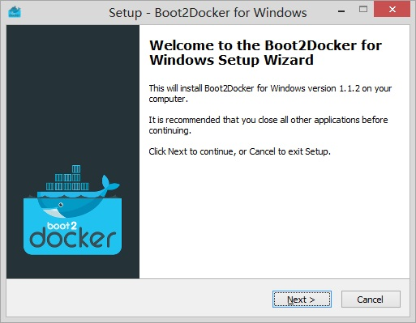
	
	在这里，安装向导建议我们关闭所有其他应用程序。如果没有特殊需要，最好能关闭其他应用，特别注意，如果你已经安装了VirtualBox或者msys-git，并且希望在后面进行升级，必须要关闭原有VirtualBox或msys-git程序。否则在安装过程中将会出现下图的警告：
	
	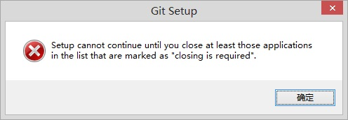
	
	下一步，选择boot2docker的安装路径，如图：
	
	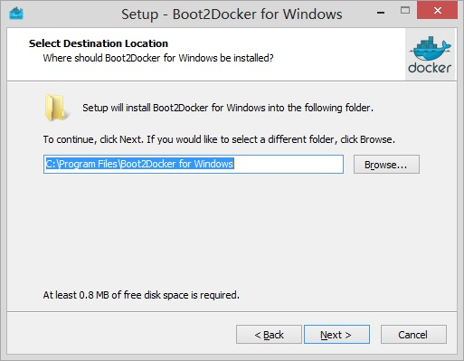
	
	如果没有什么特殊的原因，这里选择使用默认路径。接下来，选择需要安装的组件，如图：
	
	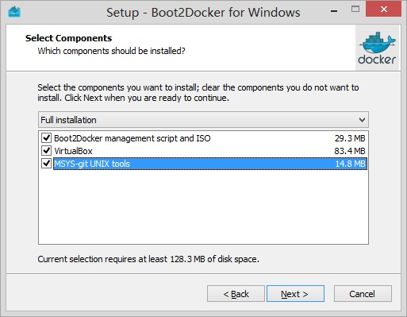
	
	我们建议你尽量使用安装包中的VirtualBox和msys-git。这里，我们选择全部安装。接下来，选择boot2docker在开始菜单中的组名称，如图：
	
	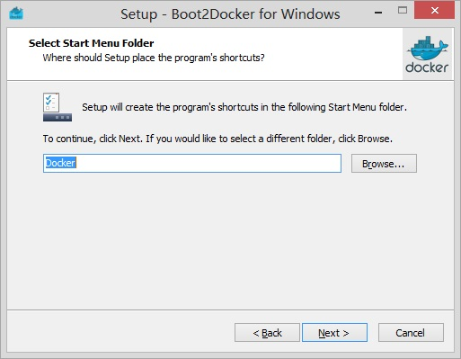
	
	建议使用默认设置。接下来，设置是否将boot2docker加入到环境变量PATH中，如图：
	
	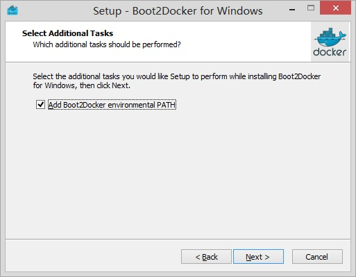
	
	将boot2docker加入到环境变量PATH中，方便通过命令行窗口启动boot2docker。虽然，我们通常使用快捷方式启动boot2docker，但是，如果没有特殊原因，这里还是选择将boot2docker加入到环境变量PATH中。
	最后，安装向导会将之前的选择总结成列表，如图：
	
	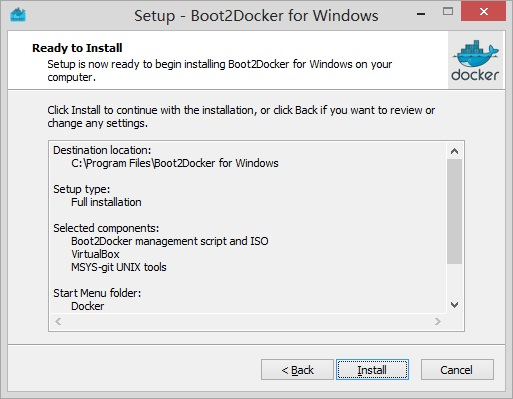
	
	点击“install”，开始安装boot2docker。在安装VirtualBox的过程中，Windows系统会提示你安装程序希望安装一些驱动软件，如图：
	
	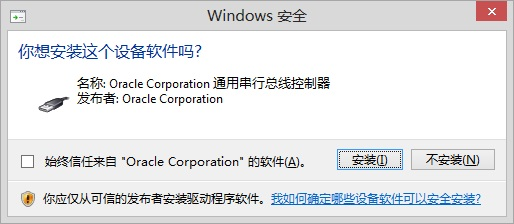
	
	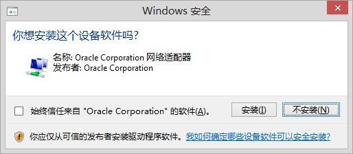
	
	全部点击“安装”按钮。boot2docker安装完成后需要重新启动电脑，如图：
	
	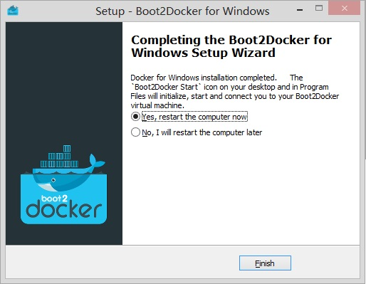
	
	选择“Yes”，重启电脑。
	
3. 运行
    
	安装完成后，你可以在桌面上找到boot2docker的快捷方式图标，如图：
	
	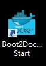
	
	双击图标，启动boot2docker。首次启动，boot2docker需要创建虚拟机环境，需要一些时间，你可以通过Log信息了解启动的过程。启动完成后，你就可以在命令行界面使用docker了，如图：
	
	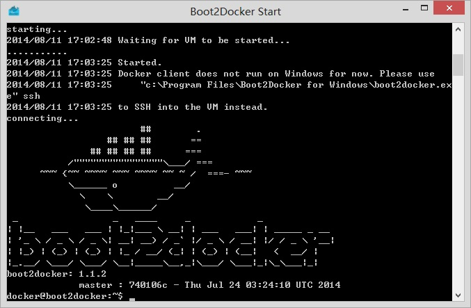
	
	至此，我们已经成功的在Windows操作系统上安装了Docker运行环境。

## MacOS环境下安装Docker

### 安装包的组成

与boot2docker的Windows安装包一样，boot2docker的MacOS安装包包含了VirtualBox虚拟机安装程序。boot2docker的核心组件是boot2docker ISO（一个定制版的轻量级Linux操作系统内核）。另外，安装包中还包含一个用go语言开发的命令行程序boot2docker_cli用于与运行在VirtualBox上的boot2docker系统内核交互。

### 准备

目前（2014年8月）最新的boot2docker MacOS安装包版本是1.2.0。Docker项目组在Mac OS X 10.6(Snow Leopard)已经之后的版本上进行了测试，如果你的系统版本在此之前，我们建议你先升级操作系统版本。

如果你已经安装了VirtualBox，并且涉及到的数据很重要，我们建议你最好先对数据进行备份。安装包中的VirtualBox版本是4.3.12。如果你使用的版本比这个老，我们建议你使用安装包中的版本，否则可能会在后面的安装和使用中出现问题。

我们建议你在安装之前关闭所有其他应用程序。特别是，如果你已经安装了VirtualBox，请务必在安装之前关闭VirtualBox。否则在安装中，会出现错误提示，如图：

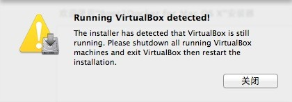
	
### 全新安装

1. 下载

    boot2docker的MacOS安装包可以从github上下载，连接地址是：[https://github.com/boot2docker/osx-installer/releases](https://github.com/boot2docker/osx-installer/releases)。下载编译后的安装程序。
	
	
2. 安装

    双击安装包（Boot2Docker-X.X.X.pkg），启动安装程序。
	安装过程由一组向导组成，第一个页面如图：
	
	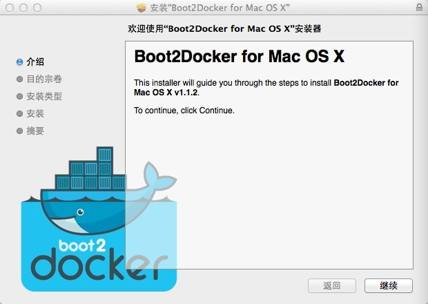
	
	点击“继续”按钮，下一个页面提示“选择一个目的宗卷”，如图：
	
	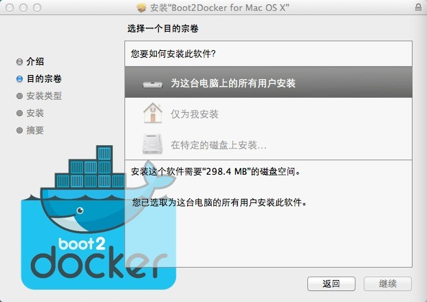
	
	默认安装在系统的/Applications文件夹内。你可以选择将boot2docker安装到你自己的Home目录下，防止这个系统下其他用户使用。也可以选择安装到一个特定的目录下。如果没有特殊需求，使用默认设置。点击“继续”按钮，安装向导计算出安装所需空间，如图：
	
	
	
	这里你可以点击“自定”按钮，来选择安装组件，或者点击“更改安装位置...”按钮，修改组件的安装位置。这里，我们使用默认设置，点击“安装”按钮，开始安装。安装向导通过进度条显示安装进度，如图：
	
	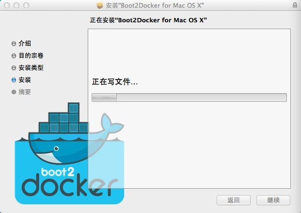
	
	安装成功后，安装向导显示“安装成功”页面，如图：
	
	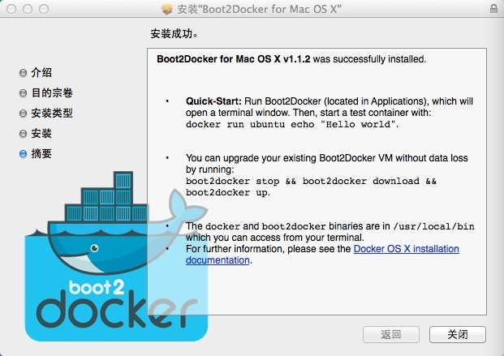
	
3. 运行
	
	安装完成后，在“LaunchPad”可以找到Boot2Docker快捷方式，点击快捷方式，启动boot2docker命令窗口。如图：
	
	
	
## CentOS6环境下安装Docker
	
### 安装包的组成

Docker的主要设计目标操作系统就是Linux，所以，Docker在Linux上的运行效率、支持程度已经共享资源是最好的。在Linux上可以选择通过编译最新源代码来获得最新的Docker版本，也可以通过资源仓库安装Docker的发布版本。这里我们选择安装EPEL上的Docker发布版本，在后面的章节，我们将为大家介绍如何通过源代码编译最新版本的Docker程序，以及如何定制自己的Docker运行环境。

EPEL资源仓库上的Docker发布版本的版本号为1.0.0。比前面介绍的Windows系统和MacOS系统的安装包中的Docker内核版本要低。两个版本最大的区别是，新版本的Docker使用了自己开发的Linux容器libcontainer来替代LXC。

### 准备

Docker需要Linux内核版本必须是2.6.32-431或更高版本（CentOS6.5 final使用的是这个版本的内核）。如果你的内核版本没有达到这个要求，安装程序会提示错误：`To run Docker, you will need CentOS6 or higher, with a kernel version 2.6.32-431 or higher as this has specific kernel fixes to allow Docker to run.`。

由于从中国大陆地区访问CentOS官方源仓库速度比较慢，建议在安装之前将源仓库改到阿里云的镜像服务器上，同时为CentOS加上EPEL资源仓库：
```bash
sudo mv /etc/yum.repos.d/CentOS-Base.repo /etc/yum.repos.d/CentOS-Base.repo.bak
sudo wget -O /etc/yum.repos.d/CentOS-Base.repo \
     http://mirrors.aliyun.com/repo/Centos-6.repo
sudo wget -O /etc/pki/rpm-gpg/RPM-GPG-KEY-EPEL-6 \
     http://mirrors.aliyun.com/epel/RPM-GPG-KEY-EPEL-6
sudo rpm --import /etc/pki/rpm-gpg/RPM-GPG-KEY-EPEL-6
sudo wget http://mirrors.aliyun.com/epel/6/x86_64/epel-release-6-8.noarch.rpm
sudo rpm -ivh epel-release-6-8.noarch.rpm
sudo mv /etc/yum.repos.d/epel.repo /etc/yum.repos.d/epel.repo.bak
sudo wget -O /etc/yum.repos.d/epel.repo \
     http://mirrors.aliyun.com/repo/epel-6.repo
sudo yum repolist
sudo yum makecache
```

### 安装

如果上面的准备工作都完成，实际的安装过程非常简单，命令如下：
```bash
sudo yum install docker-io
```
安装程序将docker程序安装到`/usr/bin`目录下，配置文件安装在`/etc/sysconfig/docker`。安装好docker之后，可以将docker加入到启动服务组中，命令如下：
```bash
sudo chkconfig docker on
```

### 运行

手动启动docker服务器，使用命令：
```bash
sudo service docker start
```
初次启动需要一些时间，启动好后，你可以使用docker命令管理和运行你的docker镜像和容器了。

### 升级

在Docker官网上提供各个版本的Docker程序的下载，最新版本下载地址是：[https://get.docker.io/builds/Linux/x86_64/docker-latest](https://get.docker.io/builds/Linux/x86_64/docker-latest)。升级脚本如下：
```bash
sudo service docker stop
sudo mv /usr/bin/docker /usr/bin/docker.bak
sudo wget -o /usr/bin/docker https://get.docker.io/builds/Linux/x86_64/docker-latest
sudo chmod +x /usr/bin/docker
sudo service docker start
sudo docker version
```

## CentOS7环境下安装Docker
	
### 安装包的组成

2014年7月7日，CentOS官方发布了首个CentOS7正式版。CentOS7的Linux内核升级到3.10.0，对Linux容器支持得到大大增强。

在CentOS7的Extra仓库中，有Docker的发布版。这个发布版包含了docker的一个比较老的版本(0.11.1)。相信随着Docker稳定版本的逐步退出，CentOS7会升级源仓库中的docker版本。

### 安装

在CentOS7下可以直接从源仓库安装docker，命令如下：
```bash
sudo yum install docker
```
安装程序将docker程序安装到`/usr/bin`目录下，配置文件安装在`/etc/sysconfig/docker`。安装好docker之后，可以将docker加入到启动服务组中，命令如下：
```bash
sudo systemctl enable docker.service
```

### 运行

手动启动docker服务器，使用命令：
```bash
sudo system start docker.service
```
初次启动需要一些时间，启动好后，你可以使用docker命令管理和运行你的docker镜像和容器了。

## Ubuntu Server14.04环境下安装Docker
	
### 安装包的组成

Ubuntu Server14.04使用的Linux内核版本是3.13.0，满足docker对Linux内核的最低要求。而且Ubuntu软件仓库中包含有Docker，只是版本比较旧（0.9.1）。

### 安装

Ubuntu Server14.04系统上安装docker非常方便，直接使用apt-get安装。命令如下：
```bash
sudo apt-get install docker.io
```
    注意： Ubuntu 软件源中有一个旧的适用于KDE3/GNOME2的包也叫做`docker`， 所以安装的时候要把包写成`docker.io`

安装程序将docker程序安装到`/usr/bin`目录下，Log输出到`/var/log`目录下。安装好docker之后，可以将docker加入到启动服务组中，命令如下：
```bash
sudo update-rc.d docker.io defaults
```

由于安装程序安装的是docker.io程序，所有，为了方便起见，我们创建一个docker链接。
```bash
sudo ln -sF /usr/bin/docker.io /usr/local/bin/docker
```

顺便我们可以加入命令行自动补全：
```bash
sudo sed -i '$acomplete -F _docker docker' /etc/bash_completion.d/docker
source /etc/bash_completion.d/docker
```

    注意：
    如果想要安装新版本的Docker， 那么可以这样做：
    ```bash
    sudo apt-get install -y software-properties-common
    sudo apt-key adv --keyserver hkp://keyserver.ubuntu.com:80 --recv-keys 36A1D7869245C8950F966E92D8576A8BA88D21E9
    sudo sh -c "echo deb https://get.docker.com/ubuntu docker main\
      > /etc/apt/sources.list.d/docker.list"
    sudo apt-get update
    sudo apt-get install lxc-docker
    ```
    这里也有一个curl脚本可以一键完成上面的工作：
    curl -sSL https://get.docker.com/ubuntu/ | sudo sh

### 运行

安装完docker之后，安装程序会自动启动docker，如果想手动启动docker服务器，使用命令：
```bash
sudo service docker.io start
```
初次启动需要一些时间，启动好后，你可以使用docker命令管理和运行你的docker镜像和容器了。

