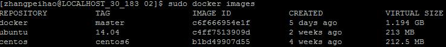
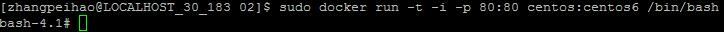
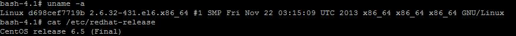
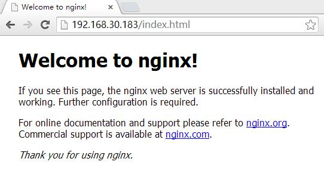

# 创建第一个容器

通过前面的学习，我们已经可以在各个平台上安装Docker的运行环境。在本章里，我们将学习如何创建一个Docker容器（这个容器里运行了一个最简单的nginx服务）。在后面的章节里，我们将会把这个容器固化成一个镜像，这样我们可以方便地将这个镜像发布到其他机器、虚拟机和云平台上。

## 下载OS镜像

我们先要下载CentOS6的最终稳定版作为基础OS平台。Docker Hub上有为Docker裁剪过的CentOS最简版本，只有200多兆。命令如下：

```bash
sudo docker pull centos:centos6
```

在国内，下载速度比较慢，所以你需要等一段时间。如果下载失败，可以重新执行上面命令，docker会在原来下载进度的基础上，继续下载。
下载完成后，你可以通过以下命令查看本地的镜像：

```bash
sudo docker images
```


结果如上图所示。列表包含镜像的名称、Tag、ID、创建时间和大小。

## 运行容器

接下来，我们使用下载的CentOS6镜像，创建并运行一个CentOS6环境的容器，然后在容器中安装Nginx，然后运行Nginx来提供Web服务。

因为我们需要将容器内的80端口绑定到宿主主机的80端口上，在运行容器之前，先要确认宿主主机的80端口没有被占用。如果宿主主机有防火墙配置，也需要将80端口放开。

输入下面命令，运行容器：
```bash
sudo docker run -t -i -p 80:80 centos:centos6 /bin/bash
```
如果运行成功，命令行界面的提示符会变为容器内系统的提示符，如图：

现在我们已经在CentOS6的运行环境中了，我们可以通过命令`uname -a`和命令`cat /etc/redhat-release`来查看操作系统版本信息，如图：


## 安装Nginx

现在，我们可以在容器中安装Nginx了。这里，我们使用Nginx的RPM发布版。如果你使用其他版本的Nginx可以参考其他安装教程来进行安装。

首先我们向容器内的操作系统添加Nginx的仓库配置。命令如下：
```bash
curl -sSL -o /etc/yum.repos.d/nginx.repo  https://raw.githubusercontent.com/zhangpeihao/LearningDocker/master/manuscript/code/02/nginx.repo
```

现在我们可以直接使用`yum install`命令安装Nginx了。安装Nginx命令如下：
```bash
yum install -y nginx
```
安装程序将Nginx程序与配置文件安装到/etc/nginx目录下，默认将网站目录放在/usr/share/nginx/html。如果需要，你可以修改Nginx的配置和网站内容。

接下来，我们启动Nginx。命令如下：
```bash
/etc/init.d/nginx start
```
现在我们可以访问宿主主机的80端口来请求网页，结果如图：


## 总结

在这章里，我们学习了从Docker Hub下载镜像，并且使用这个镜像来启动容器。在容器环境中，我们学习了安装软件和运行软件。为了快速地将Docker容器运行起来，本章节没有对Docker的命令进行详细的介绍，在后面我们将会全面地学习Docker命令的使用方法。

我们在开发和调试的场景下会经常这样在Docker容器输入命令进行交互。但是，在测试和发布场景下，我们需要将开发结果固化成易于传输的镜像。在下一章节，我们将学习如果制作自己的镜像。