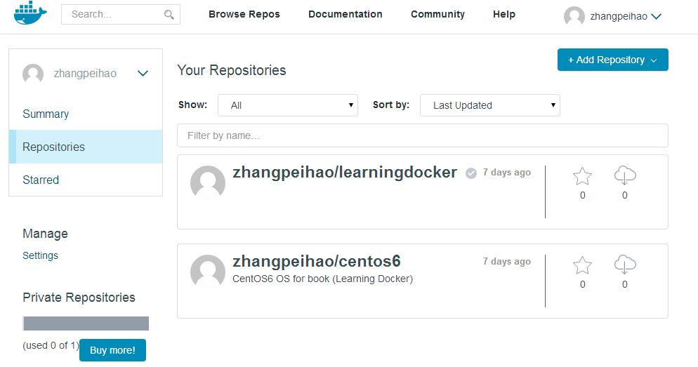
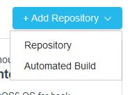
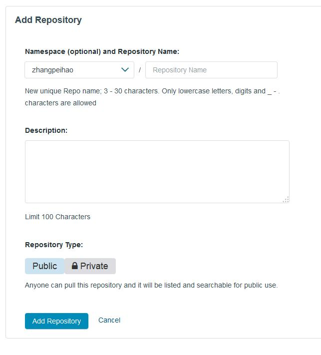
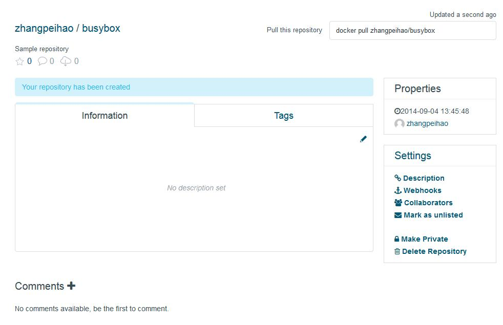
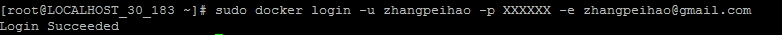
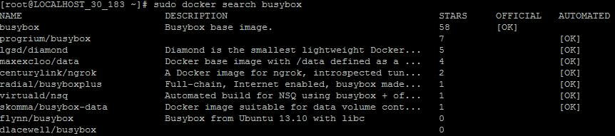
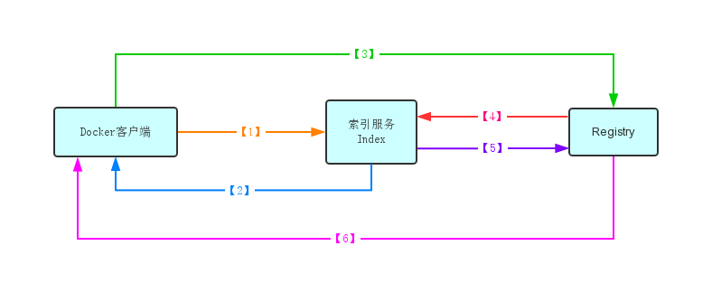

# 发布镜像

在前面，我们已经提到，Docker不但提供了容器运行引擎，还提供了运行镜像的发布和管理平台[Docker Hub](http://hub.docker.com)。
在本章中，我们将学习Docker设计的镜像管理方式，并通过范例引导大家创建自己的仓库和镜像，使用这些镜像，大家可以方便的进行发布。

## Docker在镜像管理上的设计

Docker的镜像管理需要满足以下需求：
* 像软件仓库那样管理和保存镜像，具体的功能有：
 + 查询与下载安装；
 + 依赖关系的维护；
 + 发布和更新软件；
 + 授权与认证；
* Docker为了满足各种应用场景的需要提供不同类型的服务
 + 提供了Docker Hub作为官方的镜像管理平台，免费为普通用户提供开源的镜像管理服务，同时提供收费的私有镜像管理服务；
 + Docker也在github上将docker registry项目开源，让用户可以部署完全私有的镜像管理系统；
 + 另外，docker registry将认证与镜像管理分开，用户可以设计自己的索引服务（关于索引服务，在后面会进行介绍）；
* Docker为了适应各种部署需要，提供了S3, 云文件, 本地文件存储等各种存储后台

为了满足以上需求，Docker为镜像管理设计了以下几个概念：
* Index - 索引，Docker在索引服务中实现用户的授权与认证、镜像的CheckSum管理、以及公共命名空间的管理；
* Registry - 注册表（很难找到合适的词语来对应Registry，这里参考了一些其他Docker的中文翻译使用“注册表”，但是，Registry与Windows系统中的注册表概念完全不同。为了不误导读者，在本书中，我们将直接使用英文Registry），Docker通过Registry，将版本管理、依赖管理、数据存储和授权认证分隔开，从而能够实现上面所提到的官方、镜像、私有和自认证等各种不同类型的服务。
* Repostory - 仓库，Docker中的仓库与Github上的仓库概念相同。我们在Registry上创建仓库，并在仓库中保存、记录和管理镜像与标签。
* Image - 镜像，Docker的镜像是仓库在运行环境下的一个实例。当然，也可以创建一个镜像不对应任何仓库，比如，你同样可以在本地为自己的image命名为zhangpeihao/learningdocker，但是你无法提交到Registry，因为Registry需要提交者拥有仓库zhangpeihao/learningdocker的权限。
* Tag - 标签，Docker提供标签来实现在一个仓库的不同版本。
* Layer - 层，Docker的镜像是在基础镜像之上进行扩充和修改的，包括基础镜像在内，每个扩充和修改都被看做是一个层。在数据保存上，层只保存扩充和修改的部分。
* Container - 容器，Docker容器是一个镜像个运行实例。容器在image之上增加了可写层。当在容器中修改了一个文件，那么Docker会先从镜像中把文件复制到可写层，然后在可写层对文件进行修改。

对于以上的这些概念，大家也许一下子无法理解透彻。没有关系，后面我们将通过在Docker上的实际操作，逐步理解这些概念。但是，通过这些概念，我们可以有一个认识：Docker通过将功能模块化，镜像层次化来满足Docker的各种功能和性能上的需求。

## 创建Docker Hub账号

Docker Hub是Docker官方提供的Register和Index服务。如果你身在中国大陆地区，在愉快的使用这一服务之前，需要先搭梯子，否则你可能无法完成某些操作。我正在尝试与Docker Hub反映这个问题，希望Docker Hub能做一些修改。

现在，先打开浏览器，输入网址：hub.docker.com，如果你以前没有登入过，将打开注册页面，如下图：


Docker Hub推荐使用GitHub账号进行注册，因为Docker Hub可以绑定GitHub账号，实现自动编译。虽然，你可以在后面手动绑定GitHub账号，但是，直接使用GitHub账号进行登入更方便。如果你还没有GitHub账号，请先访问[GitHub网站](https://github.com)，注册一个账号。按照提示输入GitHub的用户、密码以及Email地址，点击“Sign Up”按钮，进行注册。

注册成功后，进入个人首页，如下图：



你可以通过左上角的Search功能在公共仓库中查找你需要的镜像。这里就不做深入介绍。后面我们还会学习到通过命令来查询镜像。

## 在Docker Hub上创建仓库

接下来，我们尝试在Docker Hub上创建一个仓库。在个人首页的右上角，有创建仓库的下拉菜单（如果你没有翻墙，这个下拉菜单可能打不开），打开菜单，如下图：



菜单有两个选项，上面的"Repository"是用于创建仓库，下面的"Automated Build"用于创建自动编译项目（需要绑定GitHub）。这里我们选择"Repository"，打开设置新仓库属性的页面，如下图：



最上面是设置命名空间和仓库名，Docker Hub上命名空间使用用户名，仓库名只能是小写字母、数字、减号或下划线，这里我们输入："busybox"；下面是仓库的简介，输入："Sample repository"；最下面选择仓库的公开和私有属性。目前，Docker Hub为每一个账号提供了一个免费的私有仓库，这里，我们选择"Public"。点击"Add Repository"按钮，创建仓库，进入新仓库的首页，如下图：



## 在命令行环境创建镜像

### 登入Docker Hub

现在，打开命令行环境，输入`sudo docker login -u`*`<用户名>`*` -p `*`<密码>`*` -e `*`<Email>`*
命令。如下图：



你也可以不带参数，Docker命令行客户端会提示你输入用户名、密码和Email。
你输入的登入信息会被发送到Docker Hub的索引服务进行身份认证。如果认证成功，你的认证信息会被保存在本地Home目录的.dockercfg文件里。

### 查询镜像

前面我们提到可以在Docker Hub网站查询镜像，在命令行环境同样可以进行查询。在命令行环境输入`sudo docker search busybox`命令。如下图：



查询命令发送到Docker Hub上索引服务。在前面我们已经提到，Docker使用索引服务处理索引仓库的查询请求。这里我们看到了很多与busybox有关的仓库，并且按照星数（点赞数）进行排序。

### 下载镜像

在前一章，我们已经尝试使用`docker pull`命令下载CentOS镜像。这里，我们要下载的是zhangpeihao/busybox镜像的base标签，命令如下：

```base
sudo docker pull zhangpeihao/busybox:base
```

下载过程中，我们可以看到，Docker命令行客户端并行的下载了很多个层(layer)。busybox镜像是通过将这些层串联起来得到的。

从Docker Hub下载镜像需要经过认证、查询和下载等多个步骤。下面，我们通过示图来深入了解这些步骤。



* 第一步：Docker客户端向Docker Hub的索引服务发送镜像查询请求。
    GET /vi/repositories/zhangpeihao/busybox/images
	
* 第二步：Docker Hub的索引服务通过查找数据库，找到该仓库的所有镜像的ID和CheckSum返回给Docker客户端。
    我们可以通过下面命令直接调用Docker Hub的REST API接口：
	
	`curl -v -L -u `*`<用户名>:<密码>`*` -H "X-Docker-Token: true" -H "Accept: application/json" https://index.docker.io/v1/repositories/zhangpeihao/busybox/images`
	
	我们在返回中可以找到`X-Docker-Endpoints`头字段，表示Registry服务所在的Host地址；`X-Docker-Token`头字段，表示访问registry需要的认证信息和授权；返回的内容是所查询镜像的所有依赖的层镜像的ID和CheckSum。事实上，现在从Docker Hub取得的CheckSum都是空的，这个信息可以通过Registry的images接口直接获得。
	
* 第三步：接下来，Docker客户端使用得到的认证信息和Registry Host地址，向Registry发送下载镜像请求。

* 第四步：Registry向Docker Hub的索引服务发送验证请求，验证Docker客户端提供的认证信息是否被授权访问指定的镜像。

* 第五步：Docker Hub的索引服务返回验证结果。

* 第六步：如果Docker Hub的索引服务返回验证通过，Registry则开始响应Docker客户端的镜像下载请求。

### 使用镜像

接下来，我们可以使用下载的busybox镜像来运行容器。输入命令：

```bash
sudo docker run zhangpeihao/busybox:base /bin/echo Hello Docker
```

你可以看到容器运行并输出了"Hello Docker"。而你运行的容器实例，也可以通过下面命令看到：

```bash
sudo docker ps -la
```

从运行列表，我们可以看到，这个容器处于Exited状态。接下来，我们将在容器中运行一个在后台执行的ping进程，这个进程在`docker run`命令返回后仍然在后台运行。我们可以通过`docker logs`命令捕捉ping进程的输出。首先，输入命令：

```bash
ping_job=$(sudo docker run -d zhangpeihao/bosybox:base /bin/ping 127.0.0.1)
```

这里，-d运行选项指明希望在后台运行容器。如果你希望ping其他服务器，你可以将命令中的127.0.0.1地址改成你希望ping的服务器地址。命令执行后，界面没有任何输入，到底有没有运行成功呢？我们可以通过上面介绍的`docker ps`命令查看一下。现在，列表中显示容器的状态(STATUS)是：Up...。表示我们的容器正在运行。接下来，我们看看ping_job是一个什么值，输入命令：

```bash
echo $ping_job
```

返回的是一串字符，这就是我们运行的容器ID。它的前12位与`docker ps`命令查看到的容器ID一致。接下来，输入命令：

```bash
sudo docker logs -f -t $ping_job
```

你也可以直接输入容器ID的前3位，例如：

```bash
sudo docker logs -f -t 3a2
```

这里，-f运行选项指明希望持续监视容器的输出，-t运行选项指明希望输出每条Log的时间。现在，我们可以看到ping程序的执行结果，就像直接运行ping命令一样。你可以通过Ctrl+C输入退出`docker logs`命令，而完全不影响ping进程的执行。

接下来，输入`docker pause`命令来暂停容器的运行：

```bash
sudo docker pause $ping_job
```

再次使用`docker ps`命令来查看容器运行状态时，这个容器的状态(STATUS)仍然是：Up，但是后面括号表明Paused。这时如果再使用`docker logs`命令查看进程输出，可以看到输出停止了，并没有ping命令的停止时的总结统计信息。可以看出，此时ping进程只是被挂起了，并没有收到退出信号。接下来，我们运行命令：

```bash
sudo docker unpasue $ping_job
```

再使用`docker logs`命令查看ping命令输出，可以看到，ping命令并没有重启，seq数值在`docker unpause`命令之后继续之前数值，而没有归零。这里我们可以看到使用Docker容器可以方便的将一个容器内的进程挂起，然后再继续执行。下面，我们输入命令：

```bash
sudo docker stop $ping_job
```

从`docker logs`命令看到，输出停止，但同样没有输出ping命令退出时的统计结果。通过`docker ps`命令，可以看到，容器状态已经是：Exited。为什么没有统计结果呢，这是由于ping命令的统计结果是在收到INT信号时输出的，而`docker stop`命令发出的是TERM和KILL信号。下面，我们可以试试看使用`docker kill`命令向ping进程发送INT信号。这此之前，我们需要先把容器重新运行起来，输入命令：

```bash
sudo docker start $ping_job
```

从`docker logs`命令看到，ping命令重新运行了，seq也归零后重新计数。现在我们通过`docker kill`命令来停止容器，命令如下：

```bash
sudo docker kill -s "INT" $ping_job
```

从`docker logs`命令看到，ping命令输出了统计结果，如同本地运行ping命令一样。通过-s命令选项，我们还可以向进程发送指定的信号，甚至是用户自定义的信号。

### 提交与上传镜像

现在，我们已经创建了一个容器用来ping某个地址。接下来，我们希望把我们的工作保存到软件仓库，并提供给测试或运维来使用。首先，我们将容器保存到镜像中。输入命令：

```bash
sudo docker commit $ping_job <用户名>/busybox:ping_job
```

命令返回一串文本，这就是你新提交的镜像ID。通过`docker images`命令，你可以看到创建了一个新的image。但是，此时，这个image还只存在于本地，而且完全没有进行权限验证。也就是说，你完全可以在本地创建一个名叫"zhangpeihao/busybox:ping_job"的镜像而不上传。接下来，我们输入命令：

```bash
sudo docker push <用户名>/busybox:ping_job
```

上传成功后，会输出：`Image successfully pushed`。通过hub.docker.com网页，可以看到，busybox仓库中，增加了ping_job标签。

Docker的上传过程与之前介绍的下载过程是类似的。前两步，Docker客户端向Docker Hub的索引服务发送镜像查询请求；第三步，Docker客户端按照Docker Hub的索引服务返回的Registry服务地址，授权信息向Registry发送上传请求；第四步和第五步，Registry服务向Docker Hub请求验证Docker客户端提供的授权信息，如果验证通过，最后一步，Registry允许Docker客户端上传镜像。而上传的过程和现在的过程一样，将镜像分解成多个层进行上传。

### 使用镜像

其他人如果想要使用这个镜像，输入命令：

```bash
sudo docker pull <用户名>/busybox:ping_job
```

将镜像下载到本地，然后直接运行镜像：

```bash
sudo docker run -d <用户名>/busybox:ping_job
```

## 总结

在本章中，我们学习了怎样创建在Docker Hub上自己的账号和仓库。还学习了在本地通过Docker命令来创建一个新镜像的方法。这本章，我们学习了一些Docker命令的基本使用方法。大家可以从Docker官网提供的[命令手册](http://docs.docker.com/reference/commandline/cli/)来查看详细说明。在后面的章节，我们还会学习到更多Docker命令以及更多的使用方法。
