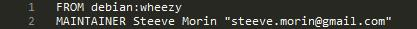
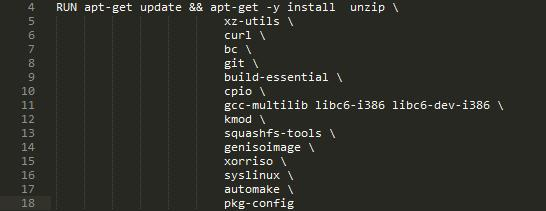
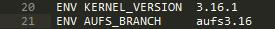

# 编写Dockerfile

在前面的章节，我们学习了通过`docker`命令来下载镜像，运行镜像，在容器中部署自己的程序，最后将容器提交到自己的镜像中。但是，这并不是Docker推荐的镜像构建方式。在这一章中，我们将学习如何通过编写Dockerfile脚本来构建和维护镜像。

## 学习boot2docker的Dockerfles

在安装Docker时，我们提到Docker的Windows安装包boot2docker就是在Docker环境下编译的。下面我们就通过[boot2docker的Dockerfile](code/04/Dockerfile-boot2docker)脚本来初步了解Dockerfile的基础知识。

### `FROM`指令和`MAINTAINER`指令



脚本的第1行是`FROM`指令。通过`FROM`指令，`docker`编译程序能够知道在哪个基础镜像执行来进行编译。所有的Dockerfile都必须以`FROM`指令开始。第二条指令`MAINTAINER`，用来标明这个镜像的维护者信息。

### `RUN`指令



接下来是`RUN`指令。这条指令用来在`docker`的编译环境中运行指定命令。上面这条指令会在编译环境运行`/bin/sh -c "apt-get update && apt-get -y install ..."`。`RUN`指令还有另外一种格式：

```
RUN ["程序名", "参数1", "参数2"]
```

这种格式运行程序，可以免除运行`/bin/sh`的消耗。这种格式使用Json格式将程序名与所需参数组成一个字符串数组，所以如果参数中有引号等特殊字符，需要进行转义。

### `ENV`指令



`ENV`指令用来指定在执行`docker run`命令运行镜像时，自动设置的环境变量。这些环境变量可以通过`docker run`命令的`--evn`参数来进行修改。

### `COPY`指令和`ADD`指令


`COPY`指令用来将本地（Dockerfile所在位置）的文件或文件夹复制到编译环境的指定路径下。上面的例子里，boot2docker的Dockerfile希望将与Dockerfile同一目录下的`kernel_config`文件复制到编译环境的`/linux-kernal/.config`。Dockerfile还提供了另外一个类似的指令：`ADD`。在复制文件方面`ADD`指令和`COPY`指令的格式和效果是完全一样的。这两个指令的区别主要由两点：

1. `ADD`指令可以从一个URL地址下载内容复制到容器的文件系统中;
2. `ADD`指令会将压缩打包格式的文件解开后复制到指定位置，而`COPY`指令只做复制操作。

### `CMD`指令


这是整个Dockerfile脚本的最后一条指令。当Dockerfile已经完成了所有环境的安装与配置，通过`CMD`指令来指示`docker run`命令运行镜像时要执行的命令。上面的例子里，在完成所有工作后，boot2docker的编译脚本将编译结果输出到本地环境下。

## 其他指令

上面我们通过boot2docker的Dockerfile脚本学习了几个最常用的指令。接下来我们再学习剩下的几个指令。

### `EXPOSE`指令

`EXPOSE <端口> [<端口>...]`指令用于标明，这个镜像中的应用将会侦听某个端口，并且希望能将这个端口映射到主机的网络界面上。但是，为了安全，`docker run`命令如果没有带上响应的端口映射参数，`docker`并不会将端口映射出了。

### `ENTRYPOINT`指令

`ENTRYPOINT`指令和前面介绍过的`CMD`一样，用于标明一个镜像作为容器运行时，最后要执行的程序或命令。这两个指令有相同之处，也有区别。通过两个指令的配合使用可以配置出不同的效果。

`ENTRYPOINT`指令有两种格式，`CMD`指令有三种格式：

```
ENTRYPOINT ["程序名", "参数1", "参数2"]
ENTRYPOINT 命令 参数1 参数2

CMD ["程序名", "参数1", "参数2"]
CMD 命令 参数1 参数2
CMD 参数1 参数2
```

`ENTRYPOINT`是容器运行程序的入口。也就是说，在`docker run`命令中指定的命令都将作为参数提供给`ENTRYPOINT`指定的程序。同样，上面列举的`CMD`指令格式的后面两种格式也将作为参数提供给`ENTRYPOINT`指定的程序。

默认的`ENTRYPOINT`是`/bin/sh -c`。你可以根据实际需要任意设置。但是如果在一个Dockerfile中出现了多个`ENTRYPOINT`指令，那么，只有最后一个`ENTRYPOINT`指令是起效的。

一种常用的设置是将命令与必要参数设置到`ENTRYPOINT`中，而运行时只提供其他选项。例如：你有一个MySQL的客户端程序运行在容器中，而客户端所需要的主机地址、用户名和密码你不希望每次都输入，你就可以将`ENTRYPOINT`设置成：`ENTRYPOINT mysql -u <用户名> -p <密码> -h <主机名>`。而你运行时，只需要指定数据库名。

### `VOLUME`指令

```
VOLUME ["路径"]
```

`VOLUME`指令用于在容器内创建一个或多个卷。而更多的时候，是在执行`docker run`时指定要创建的卷以及本地路径来进行映射。关于这个用法将在后面的章节学习到。

### `USER`指令

```
USER 用户名或用户ID
```

`USER`指令用于容器内运行`RUN`指令或`CMD`指令的用户。例如，在构建一个nginx镜像时，你希望最后运行nginx的用户为nginx，就可以在`CMD ["nginx"]`之前将用户设置为`nginx`。

如果在运行`docker run`命令时设置了`-u 用户名`参数，那么将覆盖`USER`指令设置的用户。

### `WORKDIR`指令

```
WORKDIR 路径
```

`WORKDIR`指令用于设置执行`RUN`指令、`CMD`指令和`ENTRYPOINT`指令执行时的工作目录。在Dockerfile中可以多次设置`WORKDIR`，在每次设置之后的命令将使用新的路径。

### `ONBUILD`指令

```
ONBUILD 指令
```

`ONBUILD`指令用于设置一些指令，当本镜像作为基础镜像被其他Dockerfile用`FROM`指令引用时，在所有其他指令执行之前先执行这些指令。
